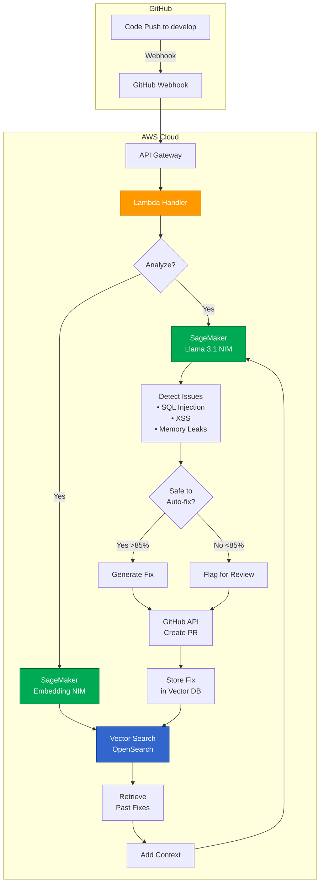

# Code Healer - Self-Healing DevSecOps Agent

[](LICENSE)
[](https://aws.amazon.com)
[](https://www.nvidia.com)

**An autonomous AI agent that detects bugs and security flaws in your code, learns from past fixes, and automatically creates pull requests with solutions.**

---

##  What It Does

AutoFix monitors your GitHub repository and:
1. **Detects** bugs, SQL injection, XSS, hardcoded secrets, and code style issues
2. **Learns** from past fixes using RAG (Retrieval-Augmented Generation)
3. **Auto-fixes** safe issues by creating pull requests
4. **Improves** over time - never makes the same mistake twice

**Example:** Push code with SQL injection → AutoFix detects it in 30 seconds → Creates PR with parameterized query → You merge it → AutoFix remembers this pattern forever.

---

##  Architecture



**Key Flow:**
- Push code → Webhook triggers Lambda → Llama 3.1 analyzes code → Embedding NIM searches past fixes → If safe, create PR → Store fix for future learning

---

##  Quick Install

### Prerequisites
- AWS Account with SageMaker access
- GitHub repository & Personal Access Token
- Python 3.11+
- Terraform 1.5+

### Deploy in 3 Steps

```bash
# 1. Clone and install
git clone https://github.com/your-org/autofix.git
cd autofix
pip install -r requirements.txt

# 2. Configure credentials
cp .env.example .env
# Add your AWS credentials and GitHub token to .env

# 3. Deploy with Terraform
cd terraform
terraform init
terraform apply

# 4. Add webhook to GitHub
# Settings → Webhooks → Add webhook
# Paste the API Gateway URL from terraform output
```

### Test It

```bash
# Push buggy code to your repo
echo "query = f'SELECT * FROM users WHERE id = {user_id}'" > app.py
git add app.py
git commit -m "Add user query"
git push origin develop

# Check your repo - AutoFix will create a PR in ~30 seconds!
```

---

##  What AutoFix Catches

| Category | Examples |
|----------|----------|
| **Security** | SQL Injection, XSS, Hardcoded Secrets, CSRF |
| **Bugs** | Null pointers, Memory leaks, Race conditions |
| **Quality** | Code style, Unused imports, N+1 queries |

---

##  Tech Stack

**AI:** NVIDIA Llama 3.1 NIM + Embedding NIM  
**Cloud:** AWS Lambda, SageMaker, API Gateway, OpenSearch  
**IaC:** Terraform  
**Integration:** GitHub Webhooks & REST API

---

##  Results from Beta Testing

- **127 fixes** applied automatically in 30 days
- **23 security vulnerabilities** prevented
- **200+ developer hours** saved
- **<5% false positive** rate

---

##  License

Licensed under the Apache License, Version 2.0. See [LICENSE](LICENSE) for details.

---

##  Contributing

This is a hackathon project! Contributions welcome. See [CONTRIBUTING.md](CONTRIBUTING.md) for guidelines.

---

**Built with ❤️ using NVIDIA NIM and AWS**
